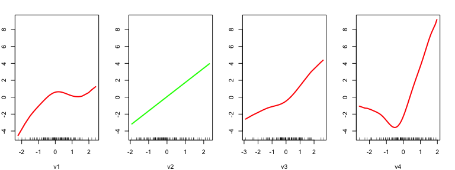
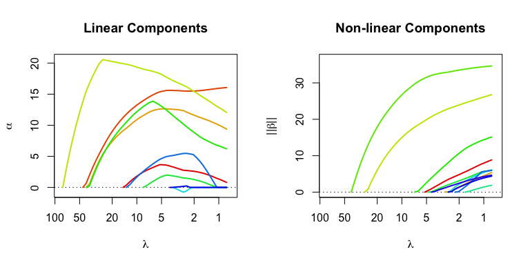
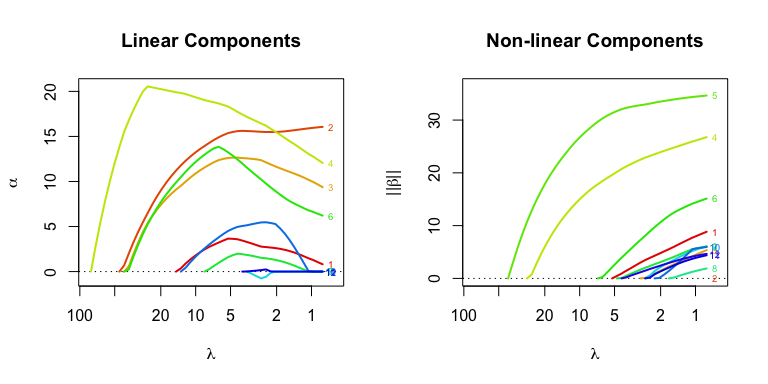

An unofficial vignette for the `gamsel` package
================
Kenneth Tay
2019-11-24

## Introduction

This is an unofficial vignette for the `gamsel` package. GAMSEL
(Generalized Additive Model Selection) is a method for fitting sparse
generalized additive models proposed by [Alexandra
Chouldechova](https://www.andrew.cmu.edu/user/achoulde/) and [Trevor
Hastie](https://web.stanford.edu/~hastie/). Here is the abstract of the
paper:

> We introduce GAMSEL (Generalized Additive Model Selection), a
> penalized likelihood approach for fitting sparse generalized additive
> models in high dimension. Our method interpolates between null, linear
> and additive models by allowing the effect of each variable to be
> estimated as being either zero, linear, or a low-complexity curve, as
> determined by the data. We present a blockwise coordinate descent
> procedure for efficiently optimizing the penalized likelihood
> objective over a dense grid of the tuning parameter, producing a
> regularization path of additive models. We demonstrate the performance
> of our method on both real and simulated data examples, and compare it
> with existing techniques for additive model selection.

Let there be \(n\) observations, each consisting of \(p\) features. Let
\(\mathbf{X} \in \mathbb{R}^{n \times p}\) denote the overall feature
matrix, and let \(y \in \mathbb{R}^n\) denote the vector of responses.
Let \(X_j \in \mathbb{R}^n\) denote the \(j\)th column of
\(\mathbf{X}\).

For each variable \(X_j\), let \(U_j \in \mathbb{R}^{n \times m_j}\) be
the matrix of evaluations of \(m_j\) basis functions
\(u_1, \dots, u_{m_j}\) at points \(x_{1j}, \dots, x_{nj}\). The model
response from GAMSEL is of the form
\(\hat{y} = \alpha_0 + \sum_{j=1}^p \alpha_j X_j + U_j \beta_j\), where
\(\beta_j \in \mathbb{R}^{m_j}\).

For more details on the method, see the [arXiv
paper](https://arxiv.org/abs/1506.03850). For `gamsel`’s official R
documentation, see [this
link](https://cran.r-project.org/web/packages/gamsel/gamsel.pdf).

## The `gamsel()` function

The purpose of this section is to give users a general sense of the
`gamsel()` function, which is probably the most important function of
the package. First, we load the `gamsel` package:

``` r
library(gamsel)
#> Loading required package: foreach
#> Loading required package: mda
#> Loading required package: class
#> Loaded mda 0.4-10
#> Loaded gamsel 1.8-1
```

Let’s generate some data:

``` r
set.seed(1)
n <- 100; p <- 12
x = matrix(rnorm((n) * p), ncol = p)
f4 = 2 * x[,4]^2 + 4 * x[,4] - 2
f5 = -2 * x[, 5]^2 + 2
f6 = 0.5 * x[, 6]^3
mu = rowSums(x[, 1:3]) + f4 + f5 + f6
y = mu + sqrt(var(mu) / 4) * rnorm(n)
```

We fit the model using the most basic call to `gamsel()`:

``` r
fit <- gamsel(x, y)
```

The function `gamsel()` fits GAMSEL for a path of lambda values and
returns a `gamsel` object. Typical usage is to have `gamsel()` specify
the lambda sequence on its own. (By default, the model is fit for 50
different lambda values.) The returned `gamsel` object contains some
useful information on the fitted model. For a given value of the
\(\lambda\) hyperparameter, GAMSEL gives the predictions of the form

<p align="center">

\(\hat{y} = \alpha_0 + \sum_{j=1}^p \alpha_j X_j + U_j \beta_j\),

</p>

where \(\alpha_0 \in \mathbb{R}\), \(\alpha_j \in \mathbb{R}\) and
\(\beta_j \in \mathbb{R}^{m_j}\) are fitted coefficients.

Printing the returned `gamsel` object tells us how many features, linear
components and non-linear components were included in the model for each
lambda value respectively. It also shows the fraction of null deviance
explained by the model and the lambda value for that model.

``` r
fit
#> 
#> Call:  gamsel(x = x, y = y) 
#> 
#>       NonZero Lin NonLin    %Dev  Lambda
#>  [1,]       0   0      0 0.00000 80.1300
#>  [2,]       1   1      0 0.03693 72.9400
#>  [3,]       1   1      0 0.06754 66.4000
#>  [4,]       1   1      0 0.09290 60.4400
#>  [5,]       1   1      0 0.11390 55.0200
#>  [6,]       1   1      0 0.13130 50.0900
#>  [7,]       1   1      0 0.14580 45.5900
#>  [8,]       2   2      0 0.16280 41.5000
#>  [9,]       5   4      1 0.23030 37.7800
#> [10,]       5   4      1 0.30230 34.3900
#> [11,]       5   4      1 0.36230 31.3100
#> [12,]       5   4      1 0.41220 28.5000
#> [13,]       5   3      2 0.45950 25.9400
#> [14,]       5   3      2 0.50910 23.6100
#> [15,]       5   3      2 0.55050 21.5000
#> [16,]       5   3      2 0.58520 19.5700
#> [17,]       5   3      2 0.61420 17.8100
#> [18,]       5   3      2 0.63850 16.2200
#> [19,]       5   3      2 0.65900 14.7600
#> [20,]       6   4      2 0.67720 13.4400
#> [21,]       7   5      2 0.69430 12.2300
#> [22,]       7   5      2 0.70940 11.1300
#> [23,]       7   5      2 0.72210 10.1400
#> [24,]       7   5      2 0.73290  9.2260
#> [25,]       7   5      2 0.74210  8.3990
#> [26,]       8   6      2 0.75040  7.6450
#> [27,]       8   6      2 0.75770  6.9590
#> [28,]       8   5      3 0.76460  6.3350
#> [29,]       8   5      3 0.77220  5.7670
#> [30,]       8   5      3 0.77910  5.2500
#> [31,]       8   4      4 0.78590  4.7790
#> [32,]       8   3      5 0.79230  4.3500
#> [33,]       9   3      6 0.79860  3.9600
#> [34,]      10   4      6 0.80470  3.6050
#> [35,]      11   5      6 0.81050  3.2810
#> [36,]      11   5      6 0.81590  2.9870
#> [37,]      11   4      7 0.82110  2.7190
#> [38,]      11   2      9 0.82710  2.4750
#> [39,]      11   2      9 0.83370  2.2530
#> [40,]      11   1     10 0.83980  2.0510
#> [41,]      11   1     10 0.84610  1.8670
#> [42,]      11   1     10 0.85220  1.7000
#> [43,]      12   1     11 0.85800  1.5470
#> [44,]      12   1     11 0.86350  1.4080
#> [45,]      12   1     11 0.86870  1.2820
#> [46,]      12   1     11 0.87330  1.1670
#> [47,]      12   1     11 0.87760  1.0620
#> [48,]      12   1     11 0.88140  0.9670
#> [49,]      12   1     11 0.88480  0.8803
#> [50,]      12   1     11 0.88790  0.8013
```

`gamsel` has a tuning parameter `gamma` which is between 0 and 1.
Smaller values of `gamma` penalize the linear components less than the
non-linear components, resulting in more linear components for the
fitted model. The default value is `gamma = 0.4`.

``` r
fit2 <- gamsel(x, y, gamma = 0.8)
```

By default, each variable is given \(m_j = 10\) basis functions. This
can be modified with the `degrees` option, and this value can differ
from variable to variable (to allow for this, pass a vector of length
equal to the number of variables to the `degrees` option).

By default, the maximum degrees of freedom for each variable is 5. This
can be modified with the `dfs` option, with larger values allowing more
“wiggly” fits. Again, this value can differ from variable to variable.

## Predictions

Predictions from this model can be obtained by using the `predict`
method of the `gamsel()` function output: each column gives the
predictions for a value of `lambda`.

``` r
# get predictions for all values of lambda
all_predictions <- predict(fit, x)
dim(all_predictions)
#> [1] 100  50

# get predictions for 20th model for first 5 observations
all_predictions[1:5, 20]
#> [1]  1.88361056 -4.47189543  8.05935149 -0.04271584  5.93270321
```

One can also specify the lambda indices for which predictions are
desired:

``` r
# get predictions for 20th model for first 5 observations
predict(fit, x[1:5, ], index = 20)
#>              l20
#> [1,]  1.88361056
#> [2,] -4.47189543
#> [3,]  8.05935149
#> [4,] -0.04271584
#> [5,]  5.93270321
```

The `predict` method has a `type` option which allows it to return
different types of information to the user. `type = "terms"` gives a
matrix of fitted functions, with as many columns as there are variables.
This can be useful for understanding the effect that each variable has
on the response. Note that what is returned is a 3-dimensional array\!

``` r
# effect of variables for first 10 observations and 20th model
indiv_fits <- predict(fit, x[1:10, ], index = c(20), type = "terms")
dim(indiv_fits)
#> [1] 10  1 12
# effect of variable 4 on these first 10 observations
plot(x[1:10, 4], indiv_fits[, , 4])
```

<!-- -->

`type = "nonzero"` returns a list of indices of non-zero coefficients at
a given lambda.

``` r
# variables selected by GAMSEL and the 10th and 50th lambda values
predict(fit, x, index = c(10, 50), type = "nonzero")
#> $l10
#> [1] 2 3 4 5 6
#> 
#> $l50
#>  [1]  1  2  3  4  5  6  7  8  9 10 11 12
```

## Plots and summaries

Let’s fit the basic `gamsel` model again:

``` r
fit <- gamsel(x, y)
```

`fit` is a class “gamsel” object which comes with a `plot` method. The
`plot` method shows us the relationship our predicted response has with
each input feature, i.e. it plots \(\alpha_j X_j + U_j \beta_j\) vs.
\(X_j\) for each \(j\). Besides passing `fit` to the `plot()` call, the
user must also pass an input matrix `x`: this is used to determine the
coordinate limits for the plot. It is recommended that the user simply
pass in the same input matrix that the GAMSEL model was fit on.

By default, `plot()` gives the fitted functions for the last value of
the `lambda` key in `fit`, and gives plots for all the features. For
high-dimensional data, this latter default is problematic as it will
produce too many plots\! You can pass a vector of indices to the `which`
option to specify which features you want plots for. The code below
gives plots for the first 4 features:

``` r
par(mfrow = c(1, 4))
par(mar = c(4, 2, 2, 2))
plot(fit, x, which = 1:4)
```

<!-- -->

The user can specify the index of the lambda value to show using the
`index`
option:

``` r
# show fitted functions for x2, x5 and x8 at the model for the 15th lambda value
par(mfrow = c(1, 3))
plot(fit, x, index = 15, which = c(2, 5, 8))
```

<!-- -->

Linear functions are colored green, non-linear functions are colored
red, while zero functions are colored blue.

Class “gamsel” objects also have a `summary` method which allows the
user to see the coefficient profiles of the linear and non-linear
features. On each plot (one for linear features and one for non-linear
features), the x-axis is the \(\lambda\) value going from large to
small. For linear components, the y-axis is the coefficient for each
variable while for the nonlinear components, it is the norm of the
nonlinear coefficients.

``` r
par(mfrow = c(1, 2))
summary(fit)
```

<!-- -->

We can include annotations to show which profile belongs to which
feature by specifying `label = TRUE`.

``` r
par(mfrow = c(1, 2))
summary(fit, label = TRUE)
```

<!-- -->

## Cross-validation (CV)

We can perform \(k\)-fold cross-validation (CV) for GAMSEL with
`cv.gamsel()`. It does 10-fold cross-validation by default:

``` r
cvfit <- cv.gamsel(x, y)
```

We can change the number of folds using the `nfolds` option:

``` r
cvfit <- cv.gamsel(x, y, nfolds = 5)
```

If we want to specify which observation belongs to which fold, we can do
that by specifying the `foldid` option, which is a vector of length
\(n\), with the \(i\)th element being the fold number for observation
\(i\).

``` r
set.seed(3)
foldid <- sample(rep(seq(10), length = n))
cvfit <- cv.gamsel(x, y, foldid = foldid)
```

A `cv.gamsel()` call returns a `cv.gamsel` object. We can plot this
object to get the CV curve with error bars (one standard error in each
direction). The left vertical dotted line represents `lambda.min`, the
`lambda` value which attains minimum CV error, while the right vertical
dotted line represents `lambda.1se`, the largest `lambda` value with CV
error within one standard error of the minimum CV error.

``` r
plot(cvfit)
```

<!-- -->

The numbers at the top represent the number of features in our original
input matrix that are included in the model.

The two special `lambda` values, as well as their indices in the
`lambda` path, can be extracted directly from the `cv.gamsel` object:

``` r
# lambda values
cvfit$lambda.min
#> [1] 3.959832
cvfit$lambda.1se
#> [1] 8.39861
# corresponding lambda indices
cvfit$index.min
#> [1] 33
cvfit$index.1se
#> [1] 25
```

## Logistic regression with binary data

In the examples above, `y` was a quantitative variable (i.e. takes
values along the real number line). As such, using the default `family =
"gaussian"` for `gamsel()` was appropriate. In theory, the GAMSEL
algorithm is very flexible and can be used when `y` is not a
quantitative variable. In practice, `gamsel()` has been implemented for
binary response data. The user can use `gamsel()` (or `cv.gamsel()`) to
fit a model for binary data by specifying `family = "binomial"`. All the
other functions we talked about above can be used in the same way.

In this setting, the response `y` should be a numeric vector containing
just 0s and 1s. When doing prediction, note that by default `predict()`
gives just the value of the linear predictors,
i.e.

<p align="center">

\(\log [\hat{p} / (1 - \hat{p})] = \hat{y} = \alpha_0 + \sum_{j=1}^p \alpha_j X_j + U_j \beta_j,\)

</p>

where \(\hat{p}\) is the predicted probability. To get the predicted
probability, the user has to pass `type = "response"` to the `predict()`
call.

``` r
# fit binary model
bin_y <- ifelse(y > 0, 1, 0)
binfit <- gamsel(x, bin_y, family = "binomial")

# linear predictors for first 5 observations at 10th model
predict(binfit, x[1:5, ])[, 10]
#> [1]  0.1293867 -0.4531994  0.4528493 -0.2539989  0.3576436

# predicted probabilities for first 5 observations at 10th model
predict(binfit, x[1:5, ], type = "response")[, 10]
#> [1] 0.5323016 0.3886003 0.6113165 0.4368395 0.5884699
```
